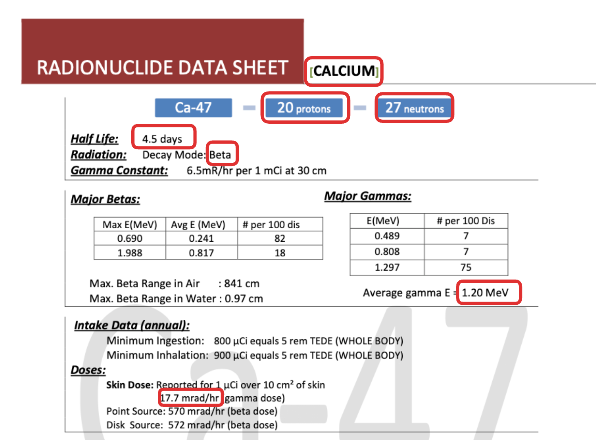

# AP Guest Lecture Task

Build a pipeline that automatically loads and extracts relevant information from PDF files uploaded to a stage and store it in tabular format.

## Setup
### Create a Snowflake Trial account
* Go to https://signup.snowflake.com/
* Choose AWS as Cloud Provider
* Choose EU (Frankfurt) as your region

### Setup your Snowflake environment
First, you will setup a database, schema and some other  to store all your objects like a stage, tables and document AI model. 
1. Create a new database named ```doc_ai_db```.
2. Create a new schema in this database called ```doc_ai_schema```. 
3. Using the ```ACCOUNTADMIN``` role >> 
    ```sql
    USE ROLE ACCOUNTADMIN;
    ```
    create a new role called ```doc_ai_role```. This role will be used to create and manage all objects necessary for this task.
4. When creating a new role, this role does not have any privileges to do much of anything... For this reason, you must give the role the proper privileges. Here are 2 example statements you have to execute to give your new role access to Snowflake's machine learning capabilities:
    ```sql
    --This allows you to use machine learning functionality
    GRANT DATABASE ROLE SNOWFLAKE.DOCUMENT_INTELLIGENCE_CREATOR TO ROLE doc_ai_role;
    GRANT CREATE SNOWFLAKE.ML.DOCUMENT_INTELLIGENCE ON SCHEMA doc_ai_db.doc_ai_schema TO ROLE doc_ai_role;

    --Use this statement as a reference to execute granting the required privileges as mentioned below
    GRANT <privilege> ON <object> TO ROLE <role>;
    ```
    Using GRANT statements, you need to give your doc_ai_role the privileges to:
    * USE (```USAGE```) and ```OPERATE``` on your ```WAREHOUSE```, which is called ```COMPUTE_WH``` (this is the standard warehouse Snowflake created for you when signing up for the trial account.)
    * USE (```USAGE```) on the ```DATABASE doc_ai_db``` you created earlier to your new role in order to allow the role to use the database you just created.
    * USE (```USAGE```) on the ```SCHEMA doc_ai_db.doc_ai_schema``` you created earlier to your new role in order to allow the role to use the schema you just created.
    * ```CREATE STAGE``` on the ```SCHEMA doc_ai_db.doc_ai_schema``` to your new role to allow you to create a stage to house your PDF files.
    * ```CREATE STREAM, CREATE TABLE, CREATE TASK, CREATE VIEW``` on the ```SCHEMA doc_ai_db.doc_ai_schema``` to your new role in order to allow the ```doc_ai_role``` to create streams, tables, tasks and views inside of the doc_ai_schema.
    * ```EXUTE TASK ON ACCOUNT``` to your ```doc_ai_role``` role to allow the ```doc_ai_role``` to execute tasks on the Snowflake account.
    * Now make sure you are able to access this role, as this is the role you will be using to train your Document AI model. 


## Train and Publish Your Document AI Model to Extract Relevant Fields 
1. Download the radioisotope_specification_sheet.zip dataset from https://github.com/niels-tropos/radioisotope_spec_sheet_sample_dataset

2. On the left-side, navigate to <strong>AI & ML >> Document AI</strong>
3. Build a new model <strong>```+ Build```</strong>
4. Name your model ```radioisotope_spec_extractor```(or anything else you like)
5. select the ```doc_ai_db``` database as your database, and ```doc_ai_schema``` as your schema
6. upload 5-15 pdf documents to the model via the ```upload documents``` button 
7. Define at least the following values to be extracted (you are encouraged to choose more):
    * the name of the element
    * number of protons
    * number of neutrons
    * half life value
    * mode of decay
    * average gamme energy
    * gamma skin dose 
    * ...

    <strong> Questions: 
    * When defining your values during model training, play around with different ways of phrasing your questions. 
    * How does the phrasing of the question impact the models accuracy? 
    * Do you recognize any patterns in how your phrasing relates to a better or worse prediction from the model?</strong> 

    

8. When finished and if your forecasted model accuracy is sufficient, you may publish the model. If you want to increase accuracy, you can always further train the model by uploading more files. 

## Create an automated document processing pipeline

1. First, you will need to create an <strong>internal stage</strong>, with the <strong>directory tables enabled</strong> and with <strong>SNOWFLAKE_SSE encryption</strong>.

2. Next, you want to automatically record any changes happening on your stage. After all, if new files are uploaded to the stage, you want your pipeline to automatically trigger. To do this, you need to create a <strong>STREAM</strong> object on your stage. To make sure the stream is activated, run the following command to refresh your stage: 
    ```sql
    --After you created stream, refresh your stage 
    ALTER STAGE <your stage name> REFRESH;
    ```
3. Now, you need a ```table``` to collect the results after the document has been processed by your Document AI model. Create a new table (with any name you prefer) in the ```doc_ai_db.doc_ai_schema``` schema that is meant to store the raw JSON output of the Document AI model and contains the following columns:
    * file_name (datatype VARCHAR)
    * file_size (datatype VARIAN)
    * last_modified (datatype VARCHAR)
    * snowflake_file_url (datatype VARCHAR)
    * json_content (datatype VARCHAR)
   
    Note that most columns are metadata, which is important to keep track of data movement and contain valuable information on the original file.

4. The next step would be to create a ```task``` object to automate the streaming of PDF files through your Document AI model and output the result to the ```table``` you just created.

    <strong> Questions: 
    * What does a ```STREAM``` object actually do/output? 
    * How do you make the task trigger when the stream detects new files being uploaded to your stage? 
    * How do you make sure no records are ever deleted in your target table and new records are only added?
    * How do you call your Document AI model?</strong> 

    When you have created your ```task```, kick it off by running the following command:
    ```sql
    ALTER TASK <task> RESUME;
    ```

5. Your pipeline should now be ready to automatically ingest any PDF files uploaded to your stage and run them through your trained Document AI model. To test this, upload <strong>5 PDF files</strong> from the PDF dataset. After a few minutes, you should see 5 new records being added to your ```table```. 

    <strong> Question: 
    * How do you look inside of a table?</strong> 

## Cleaning Up the Output

1. As you might have noticed, the output is looking a bit rough. We would like to clean the table up so <strong> that every value we extracted from the documents, has its own column</strong>  rather than being trapped in the JSON format. To do this, create a new table that contains all the metadata that the original table has, as well as the unpacked values the Document AI model extracted. To extract values from a JSON formatted cell, look into the ```PARSE_JSON()``` and ```LATERAL FLATTEN()``` functions offered by Snowflake. 

    <strong> Questions: 
    * Is there a different type of object than a table (a different type of materialisation) that might be better suited for this? 
    * Why is that?</strong> 

## Making the Pipeline More Robuust

1. Luckily for you, all provided PDF files so far were extremely similar in structure. To simulate real world scenarios, download the second (much smaller) PDF dataset named ```other_sample_dataset.zip``` that contains other PDF files with similar contents but a very different structure. Without further training your Document AI model, upload one of these files to your stage and observe that output.

    <strong> Questions: 
    * What do you observe?
    * How would you approach this problem and solve it?</strong> 

2. Further fine tune your Document AI model with more (but not all) files from the smaller dataset and test the output. 

    <strong> Questions: 
    * What do you observe?
    * Were you able to improve the accuracy?
    * Would you try s?</strong> 
